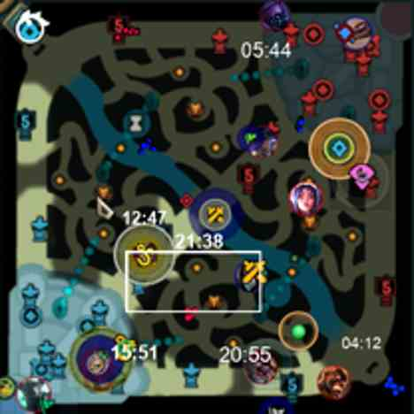
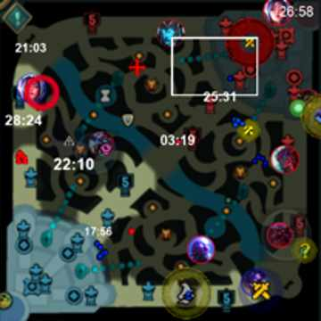
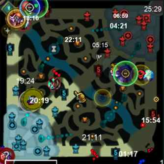
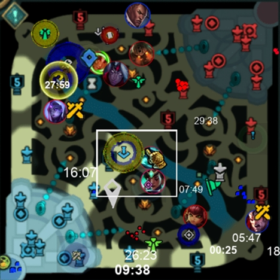
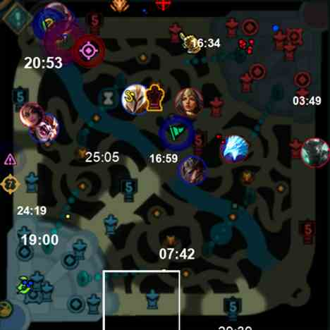
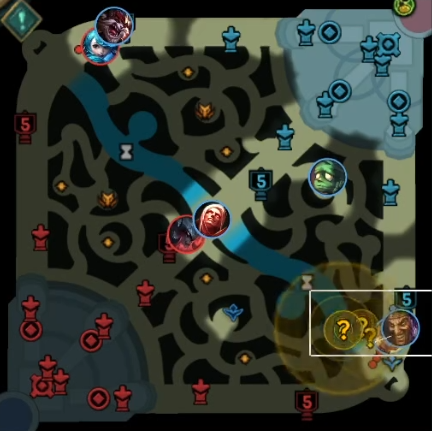

# DeeperLeague - A neural net for detecting champions' positions from a League of Legends minimap image / video

**This is part of the core technology behind [Replays.lol](https://www.replays.lol)**

For discussion / help join the Replays.lol discord here - https://discord.gg/jZnxsgubgk

## Demos

[\[Demo 1\]](https://www.youtube.com/watch?v=5HFk60yKXuY)
[\[Demo 2\]](https://www.youtube.com/watch?v=zzgkchgpzfY)

## Idea

Inspired by the ideas of [DeepLeague ](https://github.com/farzaa/DeepLeague  "DeepLeague")- but that had some big limitations that this project hopes to solve:

* Works with all champions

* Can easily be trained on new champions as soon as they come out

* Works will all quality levels (360p is okay, 240p is buggy, 480p+ is very good)

* Dataset can be generated on demand with any new effects added to the minimap

- Champions overlapping on eachother performs better

- Accurately detect champions behind new pings and particle affects 

## Training Data

In order to train a neural net, you need a large sample size of test data that has to be annotated with the data you want to be able to extract later on, in this case the coordinates and size of the champion icons on the minimap.

Previous projects have collected this data from using esports data, and using unofficial esports APIs to get the real time position of players and storing this data. - This has limitations that relate to the bullet points above.

The idea of this project is to automatically generate the test data instead so that we can create labelled test data that comes with all possible real world scenarios. - The script takes a base minimap image file, places 10 champion circles on top of it, and then adds a random assortment of minimap icons over the top (towers, ability effects, pings, the cursor, 3rd party app jungle timers, etc.), you can see the whole range in the [assets](assets) folder - these come from [CommunityDragon](https://github.com/CommunityDragon) and will need to be updated whenever new ones are added.

Even those these maps don't look like real league of legends games, they contain all of the assets that could be found in a real game, and the neural net can be trained on these to learn how to detect champions in any situation - It would probably perform better if the fake data was more realistic (e.g. champions in lanes, with towers, minions, etc.), but then it may struggle on specific edge cases that don't appear in the training data.

Examples of the generated test data:

## Pre-Trained Models

You can find 2 pre trained models in the [models](models) directory, `balanced-approach` and `conservative-learning` - they're both pretty good, conservative learning has less false positives, but also misses correct champions more - You can see their hyper parameters in the [balanced-approach.yaml](balanced-approach.yaml  "balanced-approach.yaml") and [conservative-learning.yaml](balanced-approach.yaml  "balanced-approach.yaml") files.

The folders contain the raw outputted data after training the tests on 300,000 images for 128 epochs - these took around 3 days on a system with 2x4090 GPUs.

I personally found the `balanced-approach` model performs better, as when filtering out false positives by looking at champions that don't exist in that game it performs very well.

Using these models expects a minimap cropped similar to this (as this is the size of the minimap images used in training):

## Getting started

This project requires python 3.8+ to run.

You can install the required python packages by running `pip install -r requirements.txt`

This project is set up to use CUDA for GPU acceleration, if you don't have a CUDA compatible GPU, you may need to alter the `train.py` file to use CPU instead.

For windows based systems if you're getting CUDA is not available errors, try installing the specific pytorch pacakages using the tool on this site: https://pytorch.org/get-started/locally/

## Generating test data and training the model

Generating and training the model happens in five steps:

- `scrapeChampCirclesFromCDragon.py` - running this file gets a specific champion.json file from riot to get a list of current champions, then loops through them and downloads the champion's minimap image(s) from [CommunityDragon](https://github.com/CommunityDragon) - at the moment this is hardcoded to patch 13.14 - this could be updated to always be the latest, or at least use some form of variable instead. This outputs the files in the [champions](champions) folder.
- `convertChampsToIndexes.py` - this loops through the champions directory and creates a [champMap.json](champMap.json) file for easier viewing - This step could probably be removed, or at least moved into the scraping step.
- `generateTestingData.py` - this is probably the most important step. Using the assets found in the [assets](assets) folder and it's subdirectories, it generates hundreds of thousands (based on the `total_amount` variable - currently set to 300,000) of fake minimaps at varying quality levels, with a lot of different effects over the top. There's a lot of messy logic in here (definitely could use tidying up), but the idea is it puts 10 champ icons on the map, and then dragon icons, ability particles, pings etc. over the top. It tries to encourage overlapping of champions and pings, and then alters the quality, colours and opacity of everything. The code uses multiprocessing to split this function across all available CPU cores to speed this up, a modern CPU can generate these images in around 30 minutes - lots of variables that will affect this speed.
- `prepTraining.py` - this takes the raw generated data and turns the data into a format that pytorch likes, it's basically just renames and moves the files around - could be moved into the previous step probably.
- `train.py` - this is a very basic file that uses the base yolov8n.yaml model from [utlralytics](https://github.com/ultralytics/ultralytics) and either the conservative or balanced approach hyper parameters to train the model on the generated data. It's currently hardcoded to use 2 GPUs and run for 128 epochs - these can easily be changed in the code if needed. This will generate a trained model like the ones found in the [models](models) folder (these also have been converted to tensorflowjs, so your models won't include the best.onnx, best_web_model or best_saved_model folders)

If you wish to generate new test data, be sure to delete the `raw_training_data folders` and the `dataset` folders first

## Converting to tensorflowjs
The `convert.py` script will convert your model to TensorFlow.js if you want to run it in a browser or in a node.js environment

## Running the model
Check out the [run_predction.py](run_prediction.py) file for an example of how to run the model on a single image - to run it on a video you will probably want to use ffmpeg to cut up the video into individual frames, crop the image to be just the minimap and then run the model on each frame

## YOLOv8
This model was built using the [YOLOv8](https://github.com/ultralytics/ultralytics) model

## Yuumi
Yuumi makes things very difficult - there's specific code in the `generateTestingData.py` dedicated to creating yuumi borders around people when she attaches - this works maybe 50% of the time and also causes a fair amount of false positives when she's not even in the game. I think to make this better the yuumi image generation code needs to actually be more realistic when she's attached, and also the model needs to be trained on more yuumi images - I think the model is struggling to learn the yuumi border because it's not a very common thing to see in the training data and its so abnormal compared to the other champions.

## License

This software is dual licensed. You may choose to use it under either the terms of the GNU General Public License version 3 (GPL-3.0) or you can contact me to obtain a closed source license. See [LICENSE.md](LICENSE.md) for more details.

## Contributing

If you want to contribute to this project, please raise an issue or submit a pull request. Please note that if you submit a pull request, you are agreeing to grant the project maintainer a permanent, irrevocable, unlimited license to use your code in this project under the terms of the license above - this will mean the code will be available under the GPL-3.0 license, and can also be used under the closed source license, whereby you will not receive any royalties or compensation for your contribution.
